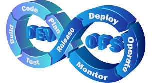

<h1 align="center" style="color: #4CAF50;">Hi 👋, I'm Tulasi Kumar Sahu</h1>

  

<h3 align="center" style="color: #2196F3;">A passionate DevOps Engineer from India, I work in the corporate IT sector. In my free time, I share knowledge through technical blogs on Hashnode and create educational YouTube videos on DevOps Alchemy.</h3>

  

- 🔭 I’m currently working on ["DevOps: Nursery to Graduation"](https://github.com/Tks-Devops)
- 🌱 I'm currently exploring **Kubernetes**
- 👨‍💻 All of my projects are available at [https://github.com/Tks-Devops](https://github.com/Tks-Devops)
- 📝 I regularly write articles on [https://hashnode.com/@CloudCraft-with-TK](https://hashnode.com/@CloudCraft-with-TK)
- 💬 Ask me about **DevOps & Cloud DevOps**
- 📫 How to reach me **tksahu.devops@gmail.com**

<h3 align="left" style="color: #FF5722;">Connect with me:</h3>

  
  
  

  
<h3 align="left" style="color: #673AB7;">Languages and Tools:</h3>

   
   
   
   
   
   
   
   
   
   

&nbsp;

<h3 align="center" style="color: #FF9800; font-size: 1.5em;">Thank you for visiting my profile! 😊</h3>
<h3 align="center" style="color: #4CAF50; font-size: 1.5em;">Feel free to reach out for any DevOps-related queries or collaboration opportunities. Let's build amazing things together! 🚀</h3>
